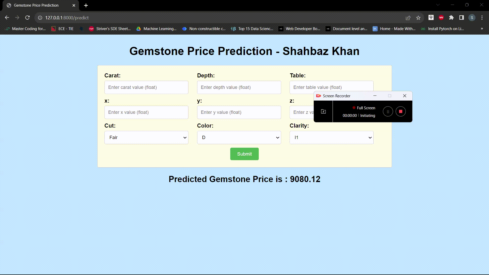

# Gemstone Price Predictor App

## Introduction

The Gemstone Price Predictor App is an application that predicts the price of gemstones based on various attributes. The app utilizes Machine Learning models and follows MLOps practices to streamline the development, deployment, and monitoring of the models.

## Demo



## Pipelines

### Continuous Integration (CI) Pipeline

The CI pipeline is triggered whenever code is pushed to the "main" branch, except for changes in the "README.md" file. The CI pipeline performs the following tasks:

1. Code Linting: The code is linted to ensure it adheres to coding standards.

2. Unit Testing: The unit tests are executed to verify the functionality of the code.

### Continuous Delivery (CD) Pipeline

The CD pipeline is triggered after successful completion of the CI pipeline. It involves building and pushing the Docker image of the Gemstone Price Predictor model to Amazon Elastic Container Registry (ECR). The CD pipeline performs the following steps:

1. Docker Image Build: A Docker container is built for the Gemstone Price Predictor model.

2. Docker Image Tagging: The Docker image is tagged with the latest version.

3. Docker Image Push: The Docker image is pushed to Amazon ECR for deployment.

### Continuous Deployment (CD) Pipeline

The CD pipeline is responsible for deploying the Docker image from Amazon ECR and serving the Gemstone Price Predictor model to users. It performs the following tasks:

1. Pull Latest Docker Image: The latest Docker image from Amazon ECR is pulled.

2. Run Docker Image: The Gemstone Price Predictor model is deployed as a Docker container and exposed on port 8080.

## MLOps Concepts Covered

The Gemstone Price Predictor App incorporates several MLOps concepts:

1. **Continuous Integration (CI):** The CI pipeline automates code testing and linting whenever code is pushed to the repository.

2. **Continuous Delivery (CD):** The CD pipeline automates the process of building and deploying the Docker image to ECR.

3. **Continuous Deployment (CD):** The CD pipeline deploys the Docker image to serve users.

4. **Versioning and Tagging:** Docker image versioning and tagging are used to ensure reproducibility and track changes.

5. **Infrastructure as Code (IaC):** The Dockerfile defines the infrastructure required for the application.

6. **AWS Integration:** AWS services, such as ECR, are integrated into the workflow for seamless deployment.

## Catboost over other algorithms

Based on Training it appears that CatBoosting Regressor outperformed the other models in terms of various performance metrics such as Root Mean Squared Error (RMSE), Mean Absolute Error (MAE), R2 Score, and precision. Here is a comparison of CatBoosting Regressor with other models:

1. CatBoosting Regressor:
   - RMSE (Test set): 576.7162
   - MAE (Test set): 297.2402
   - R2 Score (Test set): 0.9794

2. XGBRegressor:
   - RMSE (Test set): 643.8459
   - MAE (Test set): 336.3468
   - R2 Score (Test set): 0.9743

3. Random Forest Regressor:
   - RMSE (Test set): 587.9065
   - MAE (Test set): 301.7455
   - R2 Score (Test set): 0.9786

From the above comparison, it is evident that CatBoosting Regressor achieved the lowest RMSE and MAE values on the test set compared to XGBRegressor and Random Forest Regressor. This indicates that CatBoosting Regressor provided more accurate predictions with smaller errors on unseen data.

Moreover, CatBoosting Regressor also achieved the highest R2 Score on the test set, indicating better model performance in explaining the variance in the gemstone price data. The R2 Score of 0.9794 for CatBoosting Regressor suggests that approximately 97.94% of the variability in gemstone prices is captured by the model.

Additionally, CatBoosting Regressor incorporates advanced techniques to handle categorical features and can automatically handle missing values, reducing the need for extensive data preprocessing. This could have contributed to its superior performance over other models, especially when dealing with a dataset like gemstone prices, which may have categorical features.

Overall, CatBoosting Regressor demonstrated superior accuracy, lower error metrics (RMSE and MAE), and a higher R2 Score compared to XGBRegressor and Random Forest Regressor. Therefore, it was selected as the best model for gemstone price prediction in this project.

It's important to note that model selection should also consider other factors, such as model interpretability, computational complexity, and ease of implementation, based on the specific requirements of the application. However, based on the provided evaluation results, CatBoosting Regressor emerged as the top performer among the evaluated models for gemstone price prediction.


## Getting Started

To use this project locally, follow the steps below:

### Prerequisites

Make sure you have the following installed on your machine:

- Python 3.8 or later
- Docker (optional, for running the app in a container)
- AWS CLI (optional, for accessing AWS services)

### Setup

1. Clone the repository:

   ```bash
   git clone https://github.com/your-username/gemstone-price-predictor.git
   cd gemstone-price-predictor
   ```

2. Create a virtual environment (recommended):

   ```bash
   python3 -m venv venv
   source venv/bin/activate   # On Windows, use: venv\Scripts\activate
   ```

3. Install the required Python packages:

   ```bash
   pip install -r requirements.txt
   ```

### Data Ingestion

To start the data ingestion process, run the following command:

```bash
python data_ingestion.py
```

This will read the gemstone data, split it into training and test sets, and save the data in the "artifacts" directory.

### Model Training

To train the gemstone price prediction model, run the following command:

```bash
python model_trainer.py
```

The script will initiate model training using various machine learning algorithms, including CatBoost, and save the best model in the "artifacts" directory.

### Prediction

To use the trained model for prediction, you can use the `PredictPipeline` class in the `predict.py` script. Here's an example of how to predict gemstone prices for new data:

```python
from predict import PredictPipeline, CustomData

# Create a CustomData instance with gemstone attributes
gemstone_data = CustomData(
    carat=0.5,
    depth=61.8,
    table=56.0,
    x=5.12,
    y=5.15,
    z=3.18,
    cut="Ideal",
    color="E",
    clarity="SI1",
)

# Obtain the input DataFrame
input_df = gemstone_data.get_data_as_dataframe()

# Create a PredictPipeline instance
prediction_pipeline = PredictPipeline()

# Make predictions
predicted_prices = prediction_pipeline.predict(input_df)

# Print the predicted prices
print("Predicted Prices:")
print(predicted_prices)
```

### Docker Image (Optional)

If you have Docker installed, you can build and run the app in a Docker container. Follow these steps:

1. Build the Docker image:

   ```bash
   docker build -t gemstone-app .
   ```

2. Run the Docker container:

   ```bash
   docker run -p 8080:8080 gemstone-app
   ```

The app will be available at `http://localhost:8080`, and you can make predictions using the same method as described above.

## Contributing

If you wish to contribute to this project, feel free to create a pull request. We welcome your contributions and ideas.

## License

This project is licensed under the MIT License - see the [LICENSE](LICENSE) file for details.

## Acknowledgments

We would like to thank the contributors and the community for their support and valuable feedback.

Happy gemstone price prediction!